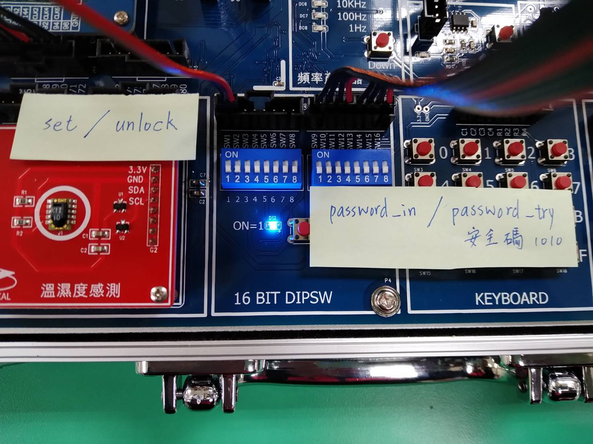
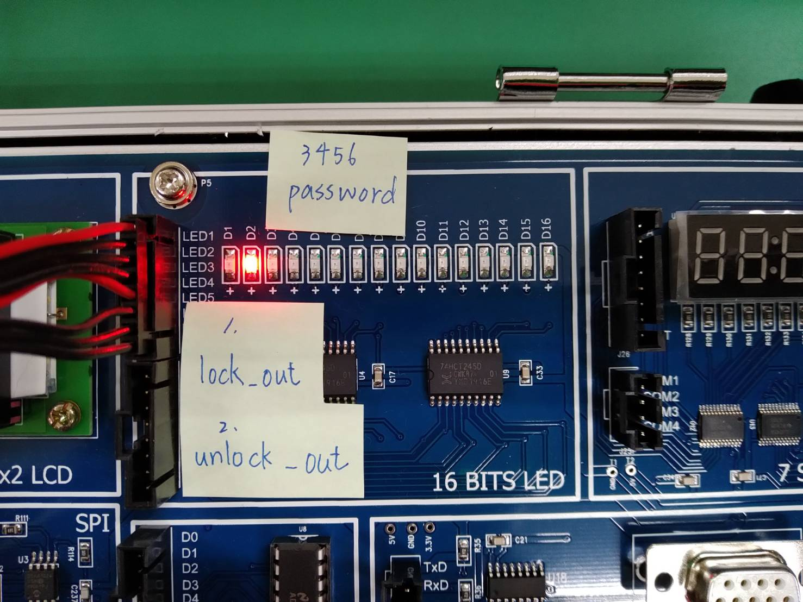

Logical-Designed_Group7
===
功能介紹:
---
1. 電子鎖
>input:
>>  * 安全碼 password_try (以防別人修改密碼)
>>  * 設定密碼 set
>>  * 輸入設定密碼 password_in
>>  * 嘗試解鎖 unlock
>>  * 輸入猜測密碼 password_try

>output:
>>  * 上鎖燈 lock_out
>>  * 解鎖燈 unlock_out
>>  * 顯示目前密碼 password_out
>>  * 蜂鳴器 beep=1 (輸入錯誤答案)

>others:
>>  * 輸入正確密碼後，輸入錯誤會鎖定
>>  * 儲存密碼 password

  
2. 點矩陣
>>  * 正確圖形  綠色:)

>>  * 錯誤圖形  紅色:(

